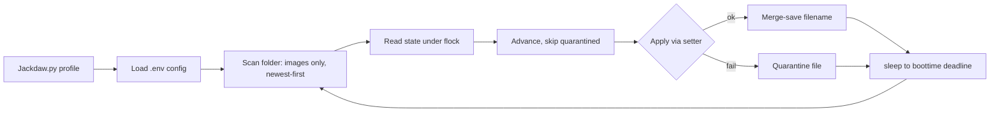

# Jackdaw

> Zero-dependency wallpaper daemon — one folder per profile, survives restarts, suspend, and broken images.


## Install

```bash
git clone git@github.com:FirozChauhan/Jackdow.git && cd Jackdaw
cp .env.example .env    # set WALLPAPERS_ROOT
```

Needs Python 3 (stdlib only) and a setter in `PATH` — [`awww`](https://github.com/LGFae/swww) (swww v3+) by default, or `SETTER=swww`. Start the setter daemon once first (`swww init` / `awww swww`).

## Usage

```bash
python3 Jackdaw.py <profile>              # daemon: cycle every DELAY_SECONDS
python3 Jackdaw.py gaming --once          # apply next wallpaper and exit
python3 Jackdaw.py gaming --set foo.avif  # apply one specific image and exit
python3 Jackdaw.py gaming --status        # current/next wallpaper + config
python3 Jackdaw.py gaming --list          # rotation order, newest first
```

One-shots are safe alongside a live daemon (state is lock-protected). Per-profile systemd service:

```ini
# ~/.config/systemd/user/jackdaw@.service
[Service]
ExecStart=/usr/bin/python3 /path/to/Jackdaw/Jackdaw.py %i
Restart=on-failure
[Install]
WantedBy=default.target
```

```bash
systemctl --user enable --now jackdaw@gaming
```

## API Reference

| Command | Signature | Returns | Description |
|---------|-----------|---------|-------------|
| daemon | `Jackdaw.py <profile>` | runs forever | Cycles the profile folder on an interval |
| `--once` | `Jackdaw.py <profile> --once` | next wallpaper | One advance, then exit; skips broken images, so cron/timer-safe |
| `--set` | `Jackdaw.py <profile> --set FILE` | named wallpaper | Applies one image from the profile folder; rejects outside paths |
| `--status` | `Jackdaw.py <profile> --status` | report | Profile, folder, setter, interval, image count, current, next |
| `--list` | `Jackdaw.py <profile> --list` | rotation list | Newest-first, marking `*` current and `>` next |

Exit codes: `0` ok, `1` validation/apply failure, `2` bad arguments.

## Features

- **Per-profile folders** — each subfolder of `WALLPAPERS_ROOT` is its own set.
- **Restart-proof state** — persists the wallpaper *filename*, not an index, so re-sorting or editing the folder never breaks rotation.
- **The loop never dies** — deleted files, unreadable folders, and failing setters are logged and skipped; broken images are quarantined so they can't livelock the rotation.
- **Suspend-safe** — intervals tracked against `CLOCK_BOOTTIME`; catches up on resume instead of drifting.
- **Concurrency-safe** — one daemon per profile; state writes go through `flock` read-merge-write.
- **Extension filtering** — only real images rotate (configurable, case-insensitive); dotfiles and junk ignored. New downloads join without a restart.

## Configuration

`.env` next to the script (real env vars override):

| Option | Type | Default | Description |
|--------|------|---------|-------------|
| `WALLPAPERS_ROOT` | path | `~/Pictures/wallpapers` | Root folder, one subfolder per profile |
| `DB_PATH` | path | `./wallpaper.json` | State file; relative paths resolve next to the script |
| `SETTER` | string | `awww` | Wallpaper setter binary |
| `DELAY_SECONDS` | int | `3600` | Seconds between changes |
| `IMAGE_EXTENSIONS` | csv | `.avif,.png,.jpg,.jpeg,.webp,.gif,.bmp,.tiff,.tif,.jxl` | What counts as a wallpaper |

State (`wallpaper.json`, git-ignored): `{"gaming": "neon-city.png", "work": "dunes.avif"}`

## Development

```bash
python3 -m py_compile Jackdaw.py       # syntax check
python3 Jackdaw.py <profile> --status  # sanity-check config
```

No build, no deps, no tests yet — `last_index`, `scan_wallpapers`, `load_env_file` are good first `pytest` targets. Stdlib-only is a feature; keep it that way.

## Architecture



Single file: config merged at import, state via atomic `mkstemp` + `os.replace` under `flock`, rotation as scan → pick → apply. Key decisions: persist filenames not indexes; check the setter's exit code; anchor sleep to `CLOCK_BOOTTIME`; never let a cycle exception escape.

## Contributing

PRs welcome. Open an issue first for major changes.

## License

[MIT](LICENSE)
