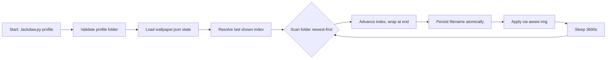

# Jackdaw

> Hazel wallpaper daemon — cycles one folder per profile, one image at a time.


---

## Why this project exists

Static wallpapers are dull, and shell-based wallpaper cycling breaks on filenames with spaces or dies whenever the folder changes. Building it as a self-contained daemon keeps the hard part — safe, restart-proof state tracking — in one small file.

## What it does

- **Per-profile folders** — every profile under `WALLPAPERS_ROOT` is its own wallpaper set (`Jackdaw.py:21`).
- **Cycles on a fixed interval** — advances one image every 3600s (`Jackdaw.py:26`).
- **Survives restarts** — last shown wallpaper is persisted to `wallpaper.json` next to the script (`Jackdaw.py:23`).
- **Saves filenames, not indexes** — state stays valid when the folder is re-sorted or images added/removed (`Jackdaw.py:108`).
- **Picks up new images live** — the folder is re-scanned every cycle, newest-first (`Jackdaw.py:47`).
- **Self-heals on empty folders** — retries next cycle instead of crashing (`Jackdaw.py:100`).
- **Safe with spaces** — applies wallpapers without a shell (`Jackdaw.py:73`).

## Architecture



`main()` loads state once, then loops forever: scan → advance → persist → apply → sleep (`Jackdaw.py:97`).

## Key technical decisions

### 1. Persist filenames, not indexes (state)
**Problem:** Storing a number breaks when the folder is re-sorted or edited.
**Solution:** Store the wallpaper's filename; look up its current index each cycle (`Jackdaw.py:108`, `Jackdaw.py:54`).
**Outcome:** Old integer entries are still accepted for backward compatibility.

### 2. Atomic state writes (reliability)
**Problem:** A crash mid-write can corrupt the JSON and kill the daemon.
**Solution:** Write to a `.tmp` file, then `os.replace` (`Jackdaw.py:39`).
**Outcome:** State is either the old or the new version, never garbage.

### 3. No-shell setter invocation (safety)
**Problem:** Shelling out mangles filenames with spaces and adds injection risk.
**Solution:** `subprocess.run` with an argument list, no shell (`Jackdaw.py:73`).
**Outcome:** Any filename is applied verbatim; a missing setter is a clean exit (`Jackdaw.py:77`).

### 4. Graceful degradation on bad input (robustness)
**Problem:** Missing folders, corrupt state, or empty directories shouldn't crash a background daemon.
**Solution:** `load_state` tolerates a missing/corrupt file (`Jackdaw.py:29`); missing folders and setters exit with a clear message (`Jackdaw.py:87`, `Jackdaw.py:91`); empty folders retry (`Jackdaw.py:100`).
**Outcome:** The daemon only stops on explicit intent (Ctrl-C, `Jackdaw.py:115`).

### 5. Filename-based re-scan every cycle (freshness)
**Problem:** New downloads should appear without a restart.
**Solution:** Re-scan and re-sort by mtime on every iteration (`Jackdaw.py:47`).
**Outcome:** Added images join the rotation instantly; removed ones are skipped safely.

## Run locally

```bash
python3 Jackdaw.py <profile>
```

Requirements: Python 3 only (stdlib, zero deps). Requires the setter binary `awww` (swww v3+) in `PATH` (`Jackdaw.py:25`). Zero configuration — edit `WALLPAPERS_ROOT` at `Jackdaw.py:21` to point at your wallpaper tree.

## Configuration

| Env var | Required | Effects when set |
|---|---|---|
| none | — | No environment variables; the only knobs are the constants `WALLPAPERS_ROOT` and `DEFAULT_DELAY` at `Jackdaw.py:21` and `Jackdaw.py:26`. |

Runtime state lives in `wallpaper.json` (git-ignored, machine-specific):

```json
{
  "asrar": "wallhaven-8gj5j2.png",
  "bianca": "wallhaven-k7zg81.jpg",
  "hazel": "59a1d66b085ce.jpg"
}
```

## Project structure

```
Jackdaw/
├── Jackdaw.py          # the daemon (one file, ~120 lines)
├── wallpaper.json      # runtime state: profile -> last wallpaper filename
├── .gitignore          # ignores wallpaper.json, .freebuff/, __pycache__
└── README.md
```

---

Walls, one profile at a time — no config, no index math, just files.

---

<div align="left">
  <font face="Aref Ruqaa" size="5">فیروز خان چوہان</font>
</div>
