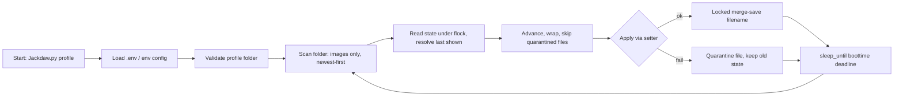

# Jackdaw

> Zero-dependency wallpaper daemon — cycles one folder per profile, survives restarts, suspend, and broken images.


## Install

```bash
git clone git@github.com:FirozChauhan/Jackdow.git && cd Jackdaw
cp .env.example .env        # point WALLPAPERS_ROOT at your wallpaper tree
```

Requirements: Python 3 (stdlib only) and a wallpaper setter in `PATH` —
[`awww`](https://github.com/LGFae/swww) (swww v3+) by default, or set `SETTER=swww`
for older installs.

```bash
# swww users: the setter daemon must be running once before Jackdaw applies images
swww init   # or: awww swww
```

## Usage

```bash
python3 Jackdaw.py <profile>              # run the daemon (cycle every DELAY_SECONDS)
```

One-shot commands — safe to run alongside a live daemon (state is lock-protected):

```bash
python3 Jackdaw.py gaming --once          # apply next wallpaper and exit
python3 Jackdaw.py gaming --set foo.avif  # apply one specific image and exit
python3 Jackdaw.py gaming --status        # current/next wallpaper + effective config
python3 Jackdaw.py gaming --list          # rotation order, newest first
```

As a systemd user service, one instance per profile:

```ini
# ~/.config/systemd/user/jackdaw@.service
[Unit]
Description=Jackdaw wallpaper daemon (%i)

[Service]
ExecStart=/usr/bin/python3 /path/to/Jackdaw/Jackdaw.py %i
Restart=on-failure

[Install]
WantedBy=default.target
```

```bash
systemctl --user enable --now jackdaw@gaming
```

## API Reference

CLI interface (there is no library API — it is one script):

| Command | Signature | Returns | Description |
|---------|-----------|---------|-------------|
| daemon  | `Jackdaw.py <profile>` | runs forever | Cycles the profile folder on an interval |
| `--once` | `Jackdaw.py <profile> --once` | next wallpaper | Applies one advance and exits; skips images the setter fails on, so it is cron/timer-safe |
| `--set`  | `Jackdaw.py <profile> --set FILE` | named wallpaper | Applies one specific image from the profile folder and exits; rejects paths outside the folder |
| `--status` | `Jackdaw.py <profile> --status` | report | Prints profile, folder, setter, interval, image count, current and next wallpaper |
| `--list` | `Jackdaw.py <profile> --list` | rotation list | Lists wallpapers newest-first, marking `*` current and `>` next |

Exit codes: `0` success, `1` validation or apply failure, `2` bad arguments.

## Features

- **Per-profile folders** — every subfolder of `WALLPAPERS_ROOT` is its own wallpaper set.
- **Restart-proof state** — the last shown wallpaper is persisted by *filename*, not index, so re-sorting or editing the folder never corrupts rotation (legacy integer entries still work).
- **The loop never dies** — deleted files, unreadable folders, permission errors, and failing setters are logged and skipped; the next cycle advances to another wallpaper.
- **Failure quarantine** — an image the setter rejects is skipped on following cycles until one succeeds, so one broken file can't livelock the rotation.
- **No sleep drift, even across suspend** — intervals are tracked against `CLOCK_BOOTTIME`; a laptop suspended mid-cycle catches up on resume instead of freezing the rotation.
- **Concurrency-safe** — run one daemon per profile: state writes go through an exclusive `flock` with a read-merge-write, so daemons never clobber each other's keys.
- **Extension filtering** — only real images rotate in (avif/png/jpg/jpeg/webp/gif/bmp/tiff/jxl, case-insensitive, configurable); dotfiles and `readme.txt` junk are ignored.
- **Live re-scan** — new downloads join the rotation without a restart; removed ones are skipped safely.
- **Safe filenames** — applied without a shell, so spaces and unicode in names are verbatim.
- **Graceful shutdown** — `SIGTERM`/`Ctrl-C` both exit cleanly with the state saved.

## Configuration

All options live in `.env` next to the script; real environment variables override the file.

| Option | Type | Default | Description |
|--------|------|---------|-------------|
| `WALLPAPERS_ROOT` | path | `~/Pictures/wallpapers` | Root folder containing one subfolder per profile |
| `DB_PATH` | path | `./wallpaper.json` | State file; relative paths resolve next to the script |
| `SETTER` | string | `awww` | Wallpaper setter binary (`swww` for older installs) |
| `DELAY_SECONDS` | int | `3600` | Seconds between wallpaper changes |
| `IMAGE_EXTENSIONS` | csv | `.avif,.png,.jpg,.jpeg,.webp,.gif,.bmp,.tiff,.tif,.jxl` | Extensions considered wallpapers, case-insensitive |

Runtime state (`wallpaper.json`, git-ignored, machine-specific):

```json
{
  "work": "mountain-sunrise.avif",
  "gaming": "neon-city.png",
  "minimal": "dunes.jpg"
}
```

## Environment Variables

Copy to `.env` and edit — `.env.example` is the tracked template:

```bash
WALLPAPERS_ROOT=/home/you/Pictures/wallpapers   # required — where profiles live
SETTER=awww                                     # optional — awww (swww v3+) or swww
DELAY_SECONDS=3600                              # optional — seconds between changes
DB_PATH=./wallpaper.json                        # optional — state file location
IMAGE_EXTENSIONS=.avif,.png,.jpg,.jpeg,.webp    # optional — what counts as a wallpaper
```

## Development

```bash
git clone repo && cd Jackdaw
python3 -m py_compile Jackdaw.py     # syntax check
python3 Jackdaw.py <profile> --status  # sanity-check config resolution
```

No build step, no dependencies, no test suite yet — the pure functions
(`last_index`, `scan_wallpapers`, `load_env_file`) are good first candidates for
`pytest`. Style: stdlib-only is a feature; keep it that way.

## Architecture



Single file, three layers:

1. **Config** — `DEFAULTS` ← `.env` ← real env vars, merged at import.
2. **State** — `load_state` / `save_state` / `merge_save`: tolerant reads, atomic writes (`mkstemp` + `os.replace`), `flock`-serialized read-merge-write.
3. **Rotation** — `scan_wallpapers` → `pick_next` → `set_wallpaper`, driven by the daemon loop or the `--once`/`--set` one-shots.

Key decisions: persist filenames not indexes; check the setter's exit code and quarantine failures; anchor sleep to `CLOCK_BOOTTIME` deadlines; never let a per-cycle exception escape the loop.

## Contributing

PRs welcome. Open an issue first for major changes.

## License

[MIT](LICENSE)
